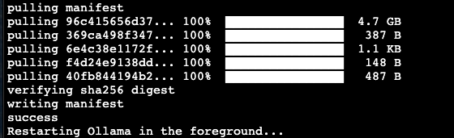
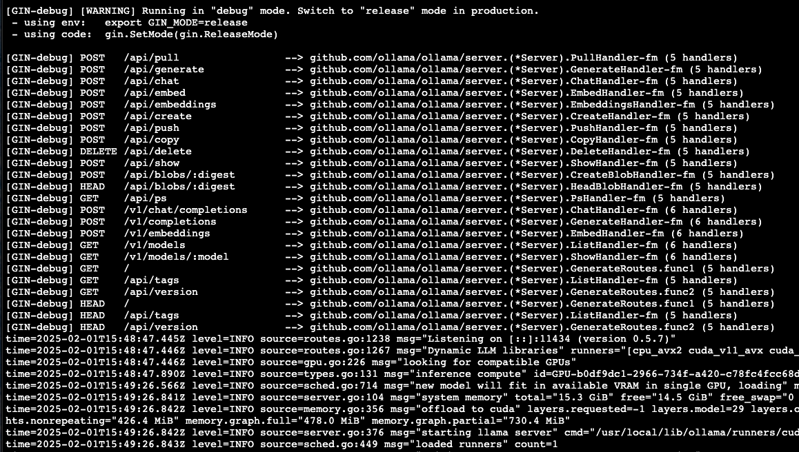

# Deepseek Private Setup

## Setup
1. Run EC2 instance with GPU and a public IP
2. Clone git repo
    ```bash
   sudo -i
   cd ~
   git clone 
    ```
3. Run setup.sh to install dependencies
    ```bash
   cd deepseek_docker
   chmod +x setup.sh
   ./setup.sh
    ```
   **Note:** Instance will restart
4. Build Docker image
    ```bash
   sudo -i
   cd ~/deepseek_docker
   docker build -t deepseek-server .
    ```
5. Run Docker image
    ```bash
   docker run -d --name deepseek-server \
    --gpus=all \
    --cap-drop=ALL \
    --security-opt no-new-privileges \
    -p 11434:11434 deepseek-server
    ```
6. Check for container to be ready
    ```bash
   docker logs deepseek-server -f
    ```
   Pulling the deepseek image

    

    Server running
    
    
7. Verify
    From your terminal on your local computer:
    ```bash
   curl -X POST http://<PUBLIC_IP>:11434/api/generate \
    -H "Content-Type: application/json" \
    -d '{
    "model": "deepseek-r1:7b",
    "prompt": "Checking to see if this is working",
    "stream": false
    }'
    ```
    **Note:** Replace <PUBLIC_IP> with your instance's public IP.

## Security
How does running this in a docker image increase security
### Isolation:
The containerized environment isolates the application from the host system, preventing direct access to host resources.
Even if Ollama or DeepSeek has vulnerabilities, they are confined within the container.
### Reduced Attack Surface:
By installing only essential packages and removing unnecessary files, there are fewer potential points of attack.
A read-only filesystem further limits what an attacker can modify within the container.
### Controlled Network Exposure:
Only port 11434 is exposed to external traffic, minimizing network-related risks.
You can further restrict access using firewall rules or Docker's network settings.
### Reproducibility:
The immutable nature of Docker images ensures that every instance of this container will have identical configurations, reducing configuration drift and associated vulnerabilities.
### Runtime Security Options:
At runtime, add additional security options when starting the container:

These flags:

**--read-only:** Makes the filesystem read-only.

**--security-opt no-new-privileges:** Prevents processes from gaining additional privileges.